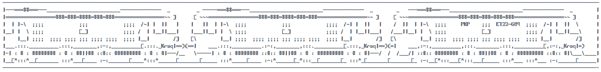

# ASCII train

Neat ASCII train made in Python using TINT.

TINT is a small library (written by me) used for displaying graphics in the terminal emulator.

## Running the code

1. Clone the GIT repository.
2. Run it with Python... common it's not that hard... it doesnt even have any dependencies.

## Extras

I LIED! It has external dependencies. But they are optional, you can install the Python keyboard library and run `main.py` again, and you will be able to drive the train! Wooooow, you can drift it too. Make sure to run it with *sudo* on Linux.